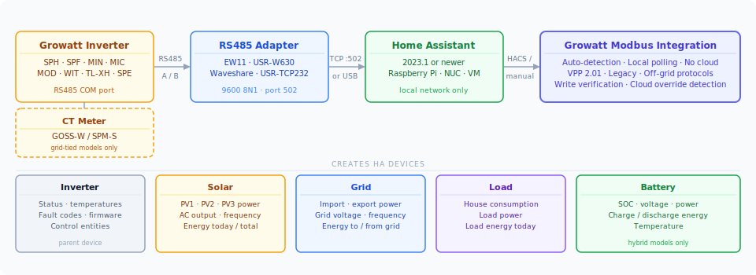
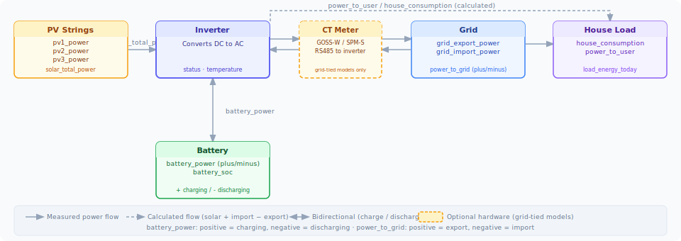

# Growatt Modbus Integration

A native Home Assistant integration for Growatt solar inverters using **direct Modbus RTU/TCP communication**. Real-time data straight from your inverter — no cloud, no ShineWiFi, no dependency on Growatt's servers.

---

## How It Works

The integration polls your inverter directly over Modbus — the same protocol the inverter uses natively. A RS485-to-TCP or RS485-to-USB adapter bridges the inverter's serial port to your Home Assistant instance. No cloud account is required and no data leaves your home network.

---

## Quick Navigation

- **[Supported Models](hardware/models.md)** — full model matrix, sensor availability, and hardware wiring
- **[Auto-Detection](hardware/autodetection.md)** — how the integration identifies your inverter
- **[Entity Reference](controls/entity-reference.md)** — all control entities with register details
- **[Battery & Scheduling](controls/battery-scheduling.md)** — TOU and charge/discharge scheduling
- **[WIT Inverter Guide](controls/wit-guide.md)** — VPP protocol control for WIT models
- **[Diagnostic Service](troubleshooting/diagnostic-service.md)** — Universal Register Scanner
- **[DTC Debugging](troubleshooting/dtc-debugging.md)** — device type code reference
- **[Adding Sensors](developer/adding-sensors.md)** — add registers and sensors to an existing profile
- **[New Profile](developer/new-profile.md)** — support a new or unsupported inverter model
- **[Release Notes](release-notes.md)** — changelog

---

## Installation

### Requirements

- Home Assistant 2024.1 or later
- A RS485-to-TCP adapter (e.g. Waveshare, USR-W630, EW11) **or** a RS485-to-USB cable
- Your inverter's Modbus slave ID (usually `1` — check the inverter display)

### HACS (Recommended)

1. Open **HACS** → **⋮ menu** → **Custom repositories**
2. Add `https://github.com/0xAHA/Growatt_ModbusTCP`, category: **Integration**
3. Search **"Growatt Modbus"** in HACS → **Download**
4. **Restart Home Assistant**
5. **Settings** → **Devices & Services** → **Add Integration** → search **"Growatt Modbus"**

### Manual

1. Download the [latest release](https://github.com/0xAHA/Growatt_ModbusTCP/releases) and extract
2. Copy `growatt_modbus/` into `config/custom_components/`
3. Restart Home Assistant and add via **Settings** → **Devices & Services**

---

## Setup

The setup wizard runs auto-detection automatically for VPP-capable inverters. For legacy models select the profile manually based on your inverter's power range.

| Parameter | TCP | Serial |
| --- | --- | --- |
| Host / Device | IP address (e.g. `192.168.1.100`) | Path (e.g. `/dev/ttyUSB0`) |
| Port / Baudrate | `502` | `9600` |
| Slave ID | `1` (usually) | `1` (usually) |

**Options (after setup):**

| Option | Default | Description |
| --- | --- | --- |
| Device Name | "Growatt" | Prefix for all sensor names |
| Scan Interval | 30 s | Polling frequency (5–300 s) |
| Connection Timeout | 10 s | Response timeout (1–60 s) |
| Invert Grid Power | Auto | Fix a backwards CT clamp |

---

## Device Structure

When you add the integration it creates **up to five devices** in Home Assistant, each grouping logically related sensors:

| Device | Always present? | Key entities |
| --- | --- | --- |
| **Inverter** | Yes | Status, inverter temp, fault code, firmware version |
| **Solar** | Yes | `pv1_power`, `solar_total_power`, `energy_today`, `energy_total` |
| **Grid** | Yes | `grid_export_power`, `grid_import_power`, `energy_to_grid_today` |
| **Load** | Yes | `house_consumption`, `power_to_load`, `load_energy_today` |
| **Battery** | Hybrid models only | `battery_soc`, `battery_power`, `charge_energy_today` |

> The Battery device is automatically created for hybrid and off-grid profiles. It does not appear for grid-tied-only models (MIC, MIN TL-X, MID).

---

## Power Flow & Sensor Glossary

Understanding which sensor measures what is the most common source of confusion. Here is how energy flows through the system and what each sensor represents.

| Sensor | What it measures | Sign / direction | HA Energy Dashboard |
| --- | --- | --- | --- |
| `pv1_power` / `pv2_power` / `pv3_power` | Individual PV string output | Always ≥ 0 W | — |
| `solar_total_power` | Combined output of all PV strings | Always ≥ 0 W | — |
| `energy_today` | PV energy generated today | Always ≥ 0 kWh | Solar production |
| `energy_total` | PV energy generated lifetime | Always ≥ 0 kWh | Solar production |
| `grid_export_power` | Power currently being sent to grid | Always ≥ 0 W | Return to grid |
| `grid_import_power` | Power currently being drawn from grid | Always ≥ 0 W | Grid consumption |
| `power_to_grid` | Raw bidirectional grid register | **+ export / − import** | (use export/import above) |
| `power_to_user` | AC power at grid/load boundary (register) | Always ≥ 0 W | Load monitoring |
| `power_to_load` | AC output power at inverter terminals | Always ≥ 0 W | — |
| `house_consumption` | **Calculated** total house draw | Always ≥ 0 W | Individual consumption |
| `self_consumption` | Solar power used on-site (not exported) | Always ≥ 0 W | Efficiency tracking |
| `battery_power` | Battery charge/discharge power | **+ charging / − discharging** | Battery storage |
| `charge_power` | Battery charging power only | Always ≥ 0 W | — |
| `discharge_power` | Battery discharging power only | Always ≥ 0 W | — |
| `battery_soc` | State of charge | 0–100 % | Battery charge level |
| `charge_energy_today` | Energy delivered into battery today | Always ≥ 0 kWh | Battery in |
| `discharge_energy_today` | Energy delivered from battery today | Always ≥ 0 kWh | Battery out |
| `energy_to_grid_today` | Total energy exported to grid today | Always ≥ 0 kWh | Return to grid |
| `load_energy_today` | Total energy consumed by house today | Always ≥ 0 kWh | Individual consumption |

> **`house_consumption` vs `power_to_user`:** `power_to_user` is a raw hardware register. `house_consumption` is calculated: solar produced + grid imported − grid exported. Use `house_consumption` in the Energy Dashboard for accurate whole-home consumption.
>
> **`battery_power` sign:** Positive = charging, negative = discharging — consistent across all models. SPF off-grid inverters report the opposite polarity in hardware; the integration corrects this automatically.
>
> **`battery_current` on SPF:** Register 68 only measures current during AC/grid charging. During PV charging it correctly reads 0 — this is a hardware limitation. Use `battery_power` for monitoring.

---

## Energy Dashboard Setup

The integration pre-configures sensors with the correct `state_class` and `device_class` for the HA Energy Dashboard. Recommended mapping:

| Dashboard slot | Sensor |
| --- | --- |
| Solar production | `sensor.{name}_energy_total` |
| Return to grid | `sensor.{name}_energy_to_grid_today` *(use total variant)* |
| Grid consumption | `sensor.{name}_energy_to_user_today` *(use total variant)* |
| Individual consumption | `sensor.{name}_load_energy_today` *(use total variant)* |
| Battery in | `sensor.{name}_charge_energy_today` *(use total variant)* |
| Battery out | `sensor.{name}_discharge_energy_today` *(use total variant)* |

> If grid values appear backwards, run the `detect_grid_orientation` service or enable **Invert Grid Power** in the integration options.

---

## Night-time Behaviour

When the inverter powers down at night the integration detects the absence of valid register data and marks the inverter as offline. Sensors retain their last daytime values rather than dropping to zero or showing unavailable — preventing phantom energy spikes in the HA Energy Dashboard.

- Sensors remain **available** with last known values
- `last_successful_update` attribute shows when data was last confirmed fresh
- Lifetime energy totals are **persisted to HA storage** and restored across HA restarts

Sensors resume normal operation automatically when the inverter wakes at sunrise.

---

## "Last Updated" on Sensors

HA only marks a sensor's `last_updated` timestamp when the value actually changes. If a sensor shows "last updated 4 minutes ago" it means the value has been constant for 4 minutes — not that polling stopped. The integration is still polling every scan interval; the inverter is simply reporting the same value each time.

---

## Supported Models at a Glance

| Family | Type | Auto-detect |
| --- | --- | --- |
| SPH TL-BH / TL3-BH | Single/three-phase hybrid | DTC |
| MOD TL3-XH | Three-phase hybrid | DTC |
| MIN TL-XH | Single-phase hybrid (small) | DTC |
| SPF ES | Off-grid | Manual |
| WIT TL3 | Three-phase commercial hybrid | DTC |
| MIC / MIN TL-X | Grid-tied | Register probe |
| MID TL3 | Three-phase grid-tied | Register probe |
| SPA TL BL | AC-coupled storage | Auto |

See [Supported Models](hardware/models.md) for the full matrix including sensor availability and hardware wiring.
